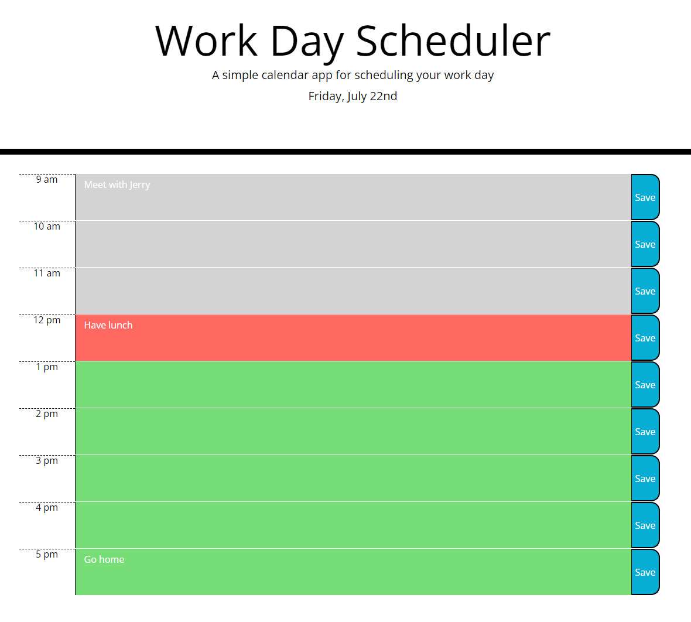

# Challenge-5: Scheduler

[Link to deployed application](https://kieferjackson.github.io/challenge-5-scheduler/)

## Purpose
Third-party APIs enable web developers to develop web applications more rapidly than with native JavaScript or CSS. Bootstrap and jQuery were used in tandem to produce a simple scheduler application using their styling and selection functionalities. Since starter code was provided, no custom CSS was added beyond what the starter code offered and all styling changed were done using Bootstrap. Moment.js was substituted for JavaScript's built-in Web API for getting local time.

## Design
The "core" of this application is the 'TimeBlock' class, which contains a method to display each timeblock to the page and convert its time in Military Time to the more conventional format in the AM/PM format. Simply, a loop is iterated for however many hours exist between the start and end of the day to create and display a timeblock using the TimeBlock class. If an event for that time is saved locally, it will be updated to display the locally saved event to the page.

---

Because neither Moment.js nor any similar third-party timekeeping API were used for displaying time, a solution using JavaScript's native Web API was used instead. However, because the values it returns are integer values (e.g. 0 for January), they had to be converted from integer values to a more useful string value. As such, a simple function was written which gets the current time as an integer, and this value is used as the input for a switch statement which selects the appropiate month or weekday. 

For ordinal numbers (e.g. 21st), a series of else if statement were used to select the correct ordinal suffix based on the remainder of the current day of the month when dividied by ten. There is an exception for numbers between 10-20, where it is incorrect for 11, 12, 13 to display as 11st, 12nd, and 13rd, so an exception is made where they terminate with a 'th' instead.

---

Here is a screenshot of the finished application:
    
